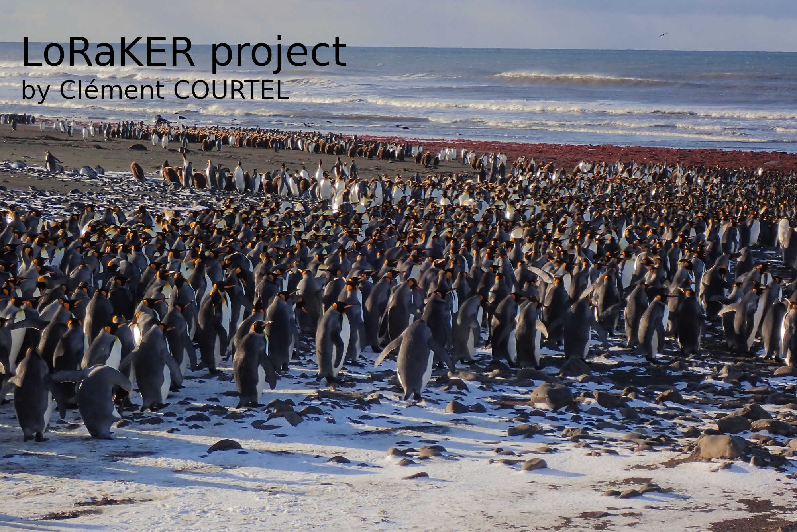
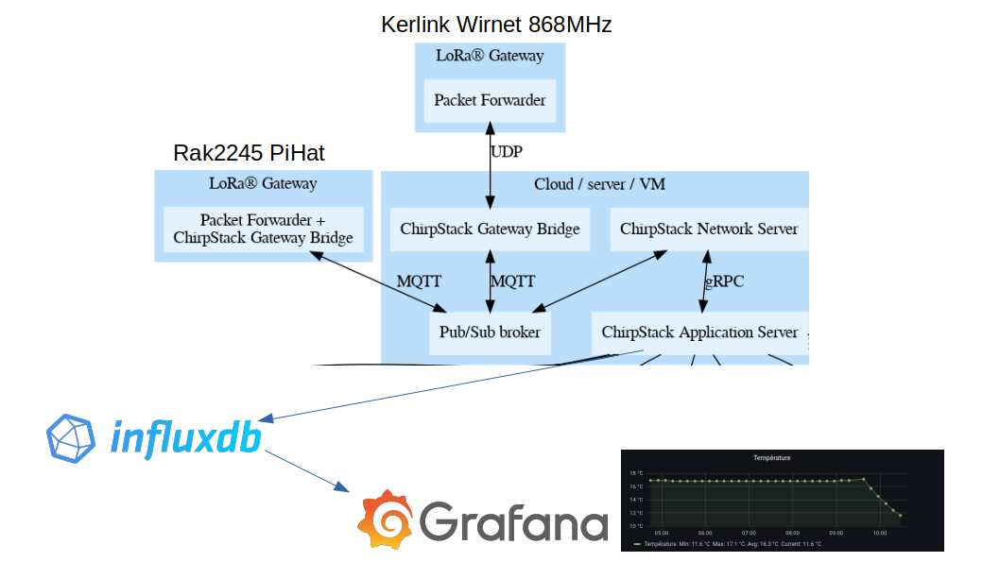
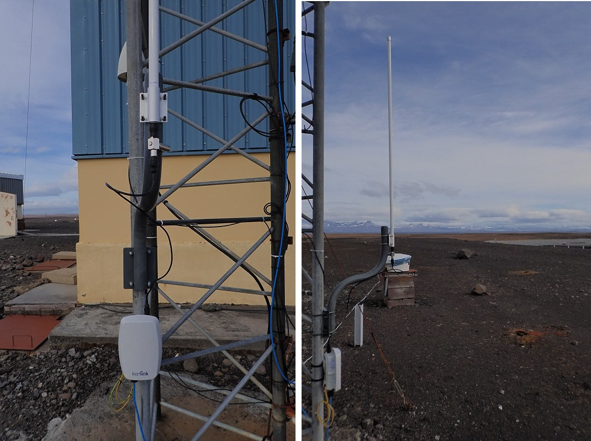
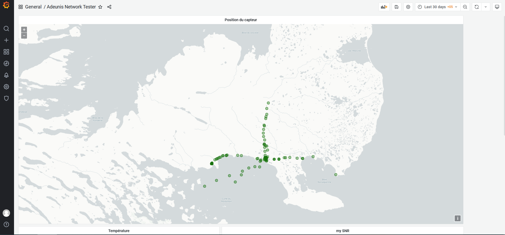
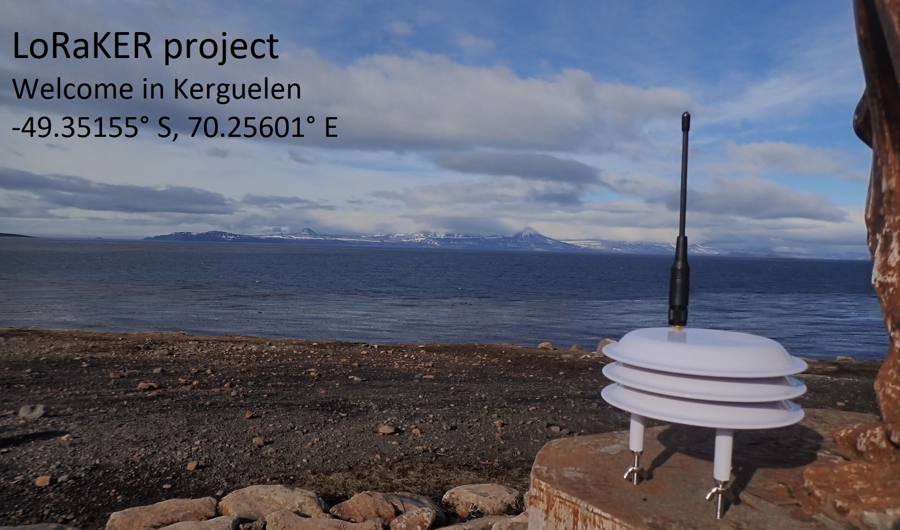
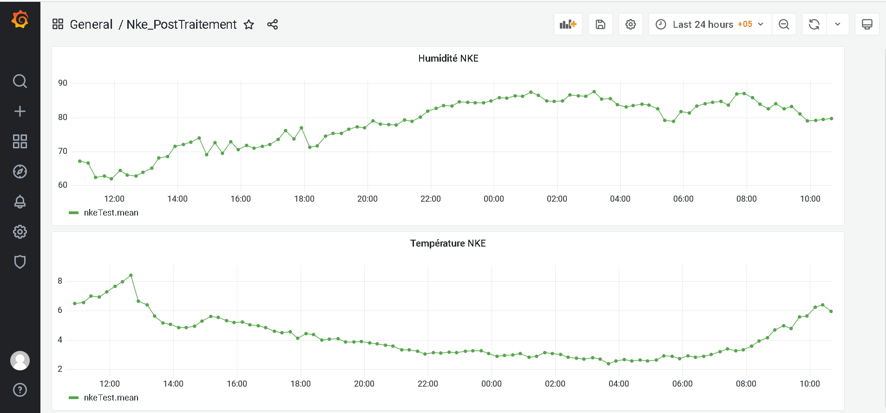
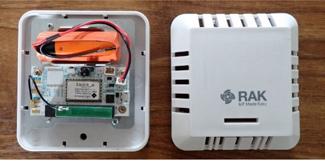
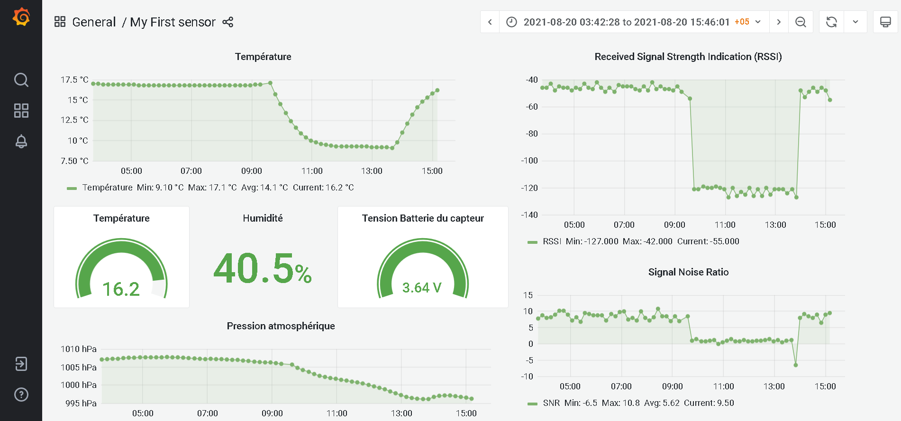

# LoRaKER - A LoRaWAN Project in extreme environment

Reports and other stuff on a LoRaWAN project in Kerguelen Island, French Southern and Antarctic Lands
With the French Polar Institute Paul-Emile Victor (IPEV), Zone Atelier Antarctique (ZATA) and French National Centre for Scientific Research (CNRS)

## Aims

- Build a complete LoRaWAN architecture On-premises : From the sensors configuration to the data analysis
- Collect, store and display data from sensors
- Share research and systems configurations on github

## Identified use case

- Collect temperature and humidity on precise geographic point
- Mesure water temperature, water height, salinity ratio 
- Collect temperature of ponds
- Get information about the state of trap
- Get GPS point of cats move

## Hardware devices

- Gateway Kerlink iStation 868MHz with 9db antenna (-141 dBm for SF12)
- Nke Atm'O (Power transmitting: 14dbm, SF: 12, Sensibility: -140dbm, LoRaWAN v1.0.2)
- Nke Magnet'O
- Adeunis Network Tester (Power transmitting: 14dbm, SF: 12, Sensibility: -140dbm, LoRaWAN v1.0.2)
- Custom Serial to LoRa converter with 6db antenna

- Gateway Kerlink WirnetStation 868MHz with 3db antenna (-141 dBm for SF12)
- Gateway RakWireless RAK2245 Pi Hat 868MHz with integrated antenna
- RakWireless RAK7204 sensor (LoRaWAN v1.0.2)
	
## Software Architecture

- Debian 10
- Chirpstack Lora Network Server
- InfluxDb v1.8.9
- Grafana v8.1.1
- **Comming soon : Docker & kubernetes**

## ToDo List :

**migrated to github project tab**

## My old Kerlink Station

## Installation of the new Kerlink iStation

### Presentation

To replace the old kerlink Wirnet Station and compare the following coverage map, I will install the new Kerlink iStation at a the same place than WirnetStation.

### Results
At the point -49.35155487, 70.25604248, at humain height for the moment

## Sensor#1 : Network Tester for LoRaWAN Coverage of Kerguelen Island

### Presentation
A map generate in real time with the Adeunis Network Tester and Grafana.This map collect RSSI and SNR information with the old 3db LoRa Antenna. The next step is to install the 9db antenna and compare the coverage data. 

### Results
My LoRa antenna coordonate are -49.35155487, 70.25604248. Actually, my furthest points are the following : 
 - To the North : -49.24661673, 70.22599993 (11,8 km of distance with a RSSI = -126dbm, SNR = -19)
 - To the West : -49.36048337, 70.06283345 (14.03 km of distance, place of "Cabane Molloy" with a RSSI = -127dbm, SNR= -6,7)
 - To the East : -49.38036659, 70.41949986 (12,26 km of distance, place of "Cabane Morne" with a RSSI = -125dbm, SNR = -10)
 - To the South : -49.40230002, 70.04283322 (16.43km of distance with a RSSI = -127dbm, SNR = -17)

## Sensor#2 : Introducing NkE Atm'O

### Presentation

Next sensor to add in the architecture. Will it survive to Kerguelen environment ? For precision on the python program to decode data, see [PythonProgram](https://github.com/ClemCrt2/Codec-Report-Batch-Python) 

###  Results

## Sensor#3 : Rak Wireless 7204

### Presentation

### Results

## Sensor#4 : Nke Watteco Magnet'O

### Presentation

This sensor is an open/close door detector system. With a magnet install on the door, the sensor can detect if the door is open or close. It power tx is +14dBm and it sensitivity is -140dBm. 
My configuration permit the sensor to send a LoRaWAN message for each state change (open or close) and to send a keepAlived message each 6 hours. For send this configuration to the sensor, you have to send the frame "1106000f000055108001816801" on the port 125.
I use this sensor on a trap for introduced mammals used by the French SubAntarctic Natural Reserve.

### Results

The sensor is in place on a trap to send it state (Open or Closed). I use grafana to display the state of the trap with the "Dynamic text" panel.

