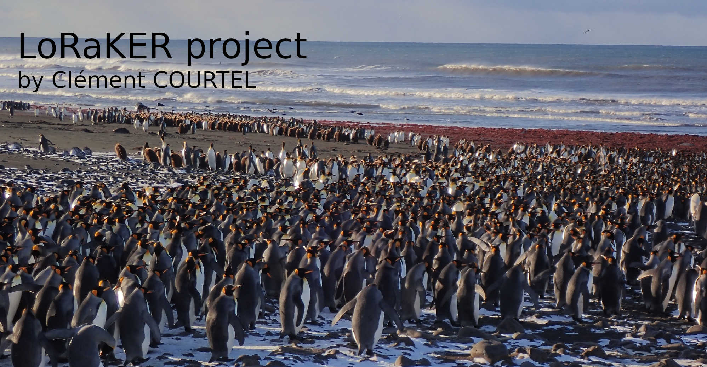

# LoRaKER - A LoRaWAN Project in extreme environment

Reports and other stuff on a LoRaWAN project in Kerguelen Island, French Southern and Antarctic Lands
With the French Polar Institute Paul-Emile Victor (IPEV), Zone Atelier Antarctique (ZATA) and French National Centre for Scientific Research (CNRS)

## Aims

- Build a complete LoRaWAN architecture On-premises
- Collect, store and display data from sensors

## Hardware devices

- Gateway Kerlink WirnetStation 868MHz
- Gateway RakWireless RAK2245 Pi Hat 868MHz
- RakWireless RAK7204 sensor
- **Comming soon : Gateway Kerlink iStation 868MHz & other devices**
	
## Software Architecture

- Debian 10
- Chirpstack Lora Network Server
- InfluxDb v1.8.9
- Grafana v8.1.1

## ToDo List :

- [] Find a way to store radio information of all gateways to infludb, actually just the RSSI and SNR of the nearest gateway are stored : 
	Replace the "Influxdb Integration" by the "http Integration" in the Application-server let appears all informations needed. But influxdb API don't understand direct http PUSH request
- [] Add LoRa ack message for RAK7204
- [] Add new objects and the gateway arriving with the next supply
- [] Upgrade influxdb 1.8 to 2.0
- [] Secure mqqt exchange with SSL
- [x] Change username/password of all the devices
- [] Discover FUOTA (Firmware Update Over The Air) functionnality
